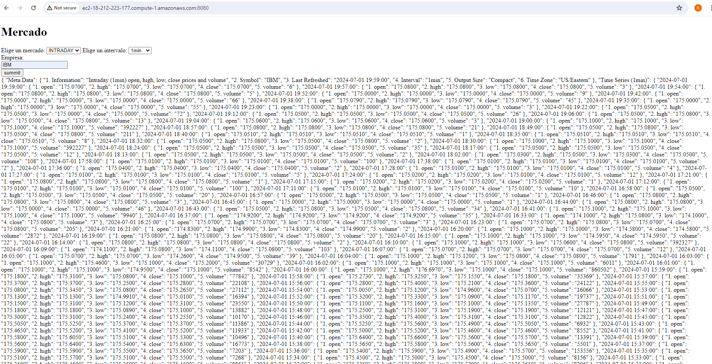
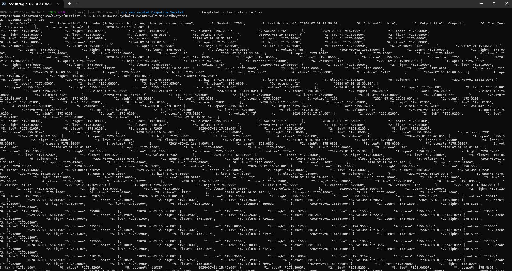
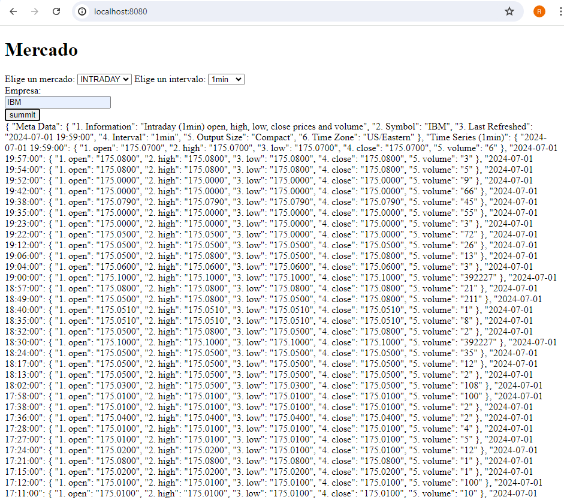
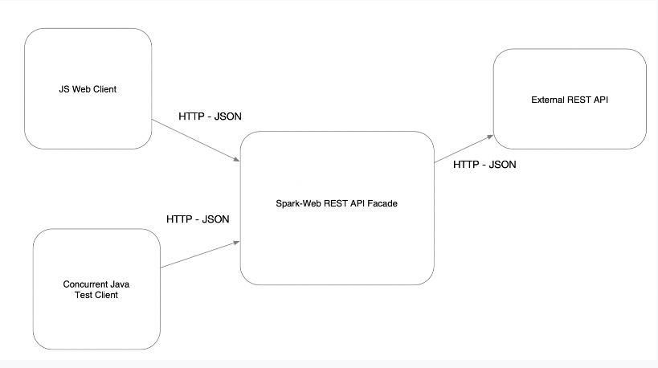

# Parcial1 - ARSW

An application to consult the stock market of shares traded on the Stock Exchange.  The application will receive the identifier of a stock, for example “MSFT” for Microsoft, which shows the intraday, daily, weekly and monthly valuation history. For this, the free API at https://www.alphavantage.co/documentation was used.


## Starting

In order to use the project on your system, you can access the following link and download a compressed file of it.

[Repository](https://github.com/Richi025/ArswParcial1.git) 

You can also clone the file using the following command.

```
git clone https://github.com/Richi025/ARSW-MultiUserBoard.git  
```

### Previous requirements

It is necessary to have "**Maven**", "**Java**", installed, preferably in their latest versions.

#### Maven
```
Download Maven at http://maven.apache.org/download.html 

Follow the instructions at http://maven.apache.org/download.html#Installation
```
#### Java

```
Download Java at https://www.java.com/es/download/ie_manual.jsp
```

### Installing

Once you have the cloned project in your repository. Follow the steps below to launch the program successfully.

#### Run BackEnd Spring-boot

1. Open a terminal and enter the folder where I clone the repository and enter the BoardSpring folder.

2. Use the following command to compile and clean the target directory.
    ```
    mvn clean compile
    ```
3. Now use the following command to package the project as a JAR file.

    ```
    mvn package
    ```

4. Now you can run the project using the following command.

    ```
    mvn spring-boot:run

    Now the server is running.
    ```

5. For use the project using the following command.

    ```
    http://localhost:8080/

    ```

## Running in AWS

Youy can access the application deployed in AWS:

http://ec2-18-212-223-177.compute-1.amazonaws.com:8080/ 





The concurrent Test in AWS



## Test

 Enter your preferred browser and input the following comand

```
    http://localhost:8080/

    You can enter what you need to consult.

```



 To run the concurrency tests you can run the tests. 

**BackApplicationTest.java**

```
     Use the following command:

     & 'C:\Program Files\Java\jdk-17\bin\java.exe' '@C:\Users\JOSE~1.VAS\AppData\Local\Temp\cp_1d9ie9huzn3g0aawmpebzeggk.argfile' 'com.example.back.BackApplicationTests' 

```


## Proyect Structure

### Run BackEnd Spring-boot


- BackApplication: 

    - Main application class for the Spring Boot application.


- BackController: 

   - REST controller for handling data. 
   - Handles GET requests to fetch market data.

- BackService: 

    - contains the logic to consult the API and return the information, Fetches market data from the external API.

- BackInterface: 

    - Is an interface that implements the getMercadoService method,  makes the code extensible.


## Architectural Design

In this proyect, i use **Dependency injection**




#### JS web client:

 + This is a web client built with JavaScript, running in a web browser.
It communicates with the main service, Spark-Web REST API Facade, using HTTP requests and exchanges data in JSON format.

#### Concurrent Java Test Client:

+ This is a client designed for testing, capable of making multiple requests at the same time.
Like the JS web client, it communicates with the Spark-Web REST API Facade using HTTP and JSON.

#### Spark-Web REST API Facade:

+ Acts as an intermediary between the clients (the JavaScript web client and the Java test client) and any external services.
Receives HTTP requests in JSON format from clients, processes them, and, if necessary, forwards them to an external API.

#### External REST API:

 + This is an external service that Spark-Web REST API Facade can interact with.
Handles tasks or provides data.

#### How they interact:

 + Both the JavaScript web client and the Java test client send requests to the Spark-Web REST API Facade.

+ The facade processes these requests, responding directly to customers.

+ Responses from all these interactions are sent to clients in JSON format over HTTP.
## Built with

* [Maven](https://maven.apache.org/) - Dependency management
* [java](https://www.java.com/es/) - Programming language
* [Spring boot](https://start.spring.io/) - Framework

### Technologies Used
+ **Java:** Programming language.
+ **Spring Boot:** Framework for building the application.


## Versioned

We use [Git](https://github.com/) for version control. For available versions, see the tags in this repository.

## Authors

* **Jose Ricardo Vasquez Vega** - [Richi025](https://github.com/Richi025)

## Date

July 02, 2024

## License

This project is licensed under the GNU license; See the [LICENSE.txt](LICENSE.txt) file for details.